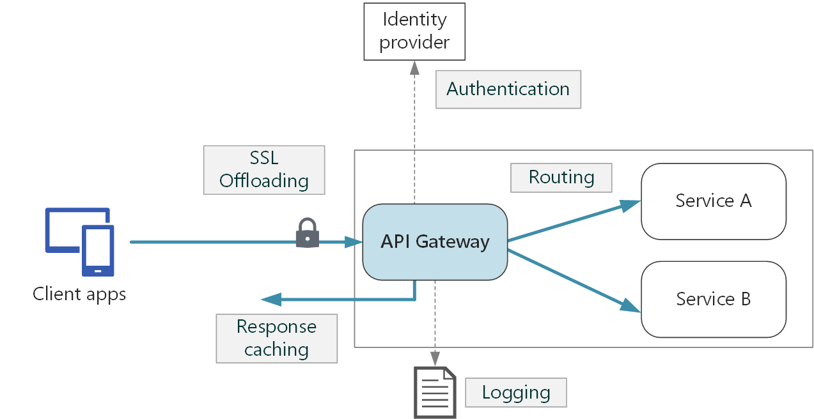

## General characteristics of Azure API Management

- the system is made up of the following components:
  - **API gateway** (the endpoint that accepts API calls and routes them, verifies API keys, JWT tokens, certificates, and credentials, enforces usage quotas and rate limits, transforms the HTTP requests/responses, caches backend responses, logs call metadata)
  - **Azure portal** (the administrative interface where you set up your API program)
  - **Developer portal** (the main web presence for developers, where they can read documentation, try out an API via the interactive console, create an account and subscribe to get API keys, and access analytics on their own usage)
- used terminology:
  - **Products**: open/protected collections of APIs
  - **Groups**: Administrators/Developers/Guests
    - Developers can sign up from the Developer portal, be created or invited to join by administrators
    - Guests have limited read-only access
  - **Policies**: are a collection of statements that are executed sequentially on the request or response of an API
- can be used with external APIs (by importing an OpenAPI Specification), Azure Functions, Azure Web Apps, etc.

## API gateways

- sit between clients and services, acting like reverse proxies 
- design patterns:
  - gateway routing: use the gateway as a reverse proxy to route requests to one or more backend services, using layer 7 routing
  - gateway aggregation: use the gateway to aggregate multiple individual requests into a single request
  - gateway offloading: use the gateway to offload some of the functionality from the backend services (SSL termination, authentication, IP allow/block list, client rate limiting, logging and monitoring, response caching, GZIP compression, servicing static content)

## API Management policies

- the policy definition is a simple XML document that describes a sequence of inbound and outbound statements
- the configuration is divided into `inbound`, `backend`, `outbound`, and `on-error`

```xml
<policies>
  <inbound>
    <!-- statements to be applied to the request go here -->
  </inbound>
  <backend>
    <!-- statements to be applied before the request is forwarded to
         the backend service go here -->
  </backend>
  <outbound>
    <!-- statements to be applied to the response go here -->
  </outbound>
  <on-error>
    <!-- statements to be applied if there is an error condition go here -->
  </on-error>
</policies>
```

- you can apply policies at different scopes (at the global level or for a particular API) via the base statement

```xml
<policies>
    <inbound>
        <cross-domain />
        <base />
        <find-and-replace from="xyz" to="abc" />
    </inbound>
</policies>
```

- example of filtering response content:

```xml
<policies>
  <inbound>
    <base />
  </inbound>
  <backend>
    <base />
  </backend>
  <outbound>
    <base />
    <choose>
      <when condition="@(context.Response.StatusCode == 200 && context.Product.Name.Equals("Starter"))">
        <!-- NOTE that we are not using preserveContent=true when deserializing the response body stream into a JSON object since we don't intend to access it again. See details on https://learn.microsoft.com/azure/api-management/api-management-transformation-policies#SetBody -->
        <set-body>
          @{
            var response = context.Response.Body.As<JObject>();
            foreach (var key in new [] {"minutely", "hourly", "daily", "flags"}) {
            response.Property (key).Remove ();
           }
          return response.ToString();
          }
        </set-body>
      </when>
    </choose>
  </outbound>
  <on-error>
    <base />
  </on-error>
</policies>
```

- control flow works like a `switch` statement

```xml
<choose>
    <when condition="Boolean expression | Boolean constant">
        <!-- one or more policy statements to be applied if the above condition is true  -->
    </when>
    <when condition="Boolean expression | Boolean constant">
        <!-- one or more policy statements to be applied if the above condition is true  -->
    </when>
    <otherwise>
        <!-- one or more policy statements to be applied if none of the above conditions are true  -->
  </otherwise>
</choose>
```

- the `forward-request` policy forwards the incoming request to the backend service specified in the request context

```xml
<forward-request timeout="time in seconds" follow-redirects="true | false"/>
```

- the `limit-concurrency` policy prevents enclosed policies from executing by more than the specified number of requests at any time; upon exceeding that number, new requests will fail immediately with a `429 Too Many Requests` status code

```xml
<limit-concurrency key="expression" max-count="number">
  <!-- nested policy statements -->
</limit-concurrency>
```

- the `log-to-eventhub` policy sends messages in the specified format to an Event Hub defined by a Logger entity

```xml
<log-to-eventhub logger-id="id of the logger entity" partition-id="index of the partition where messages are sent" partition-key="value used for partition assignment">
  <!-- Expression returning a string to be logged -->
</log-to-eventhub>
```

- the `mock-response` is used to mock APIs and operations by generating sample responses from examples or schemas; if neither examples nor schemas are found, responses with no content are returned

```xml
<mock-response status-code="code" content-type="media type"/>
```

- the `retry` policy executes its child policies once and then retries their execution until the retry `condition` becomes `false` or the retry `count` is exhausted

```xml
<retry
    condition="boolean expression or literal"
    count="number of retry attempts"
    interval="retry interval in seconds"
    max-interval="maximum retry interval in seconds"
    delta="retry interval delta in seconds"
    first-fast-retry="boolean expression or literal">
    <!-- One or more child policies. No restrictions -->
</retry>
```

- the `return-response` policy aborts pipeline execution and returns either a default or custom response to the caller; the default response is `200 OK` with no body

```xml
<return-response response-variable-name="existing context variable">
  <set-header/>
  <set-body/>
  <set-status/>
</return-response>
```

## Subscriptions

- a subscription is a named container for a pair of subscription keys
  - every subscription has two keys, a primary and a secondary
- subscriptions are scoped (All APIs, Single API, and Product level)
- developers can obtain a key by submitting a subscription request (which must be approved)
- the default header name is `Ocp-Apim-Subscription-Key`, and the default query string is `subscription-key`

Note: API Management also supports OAuth2.0

## Using certificates

- you can configure the API Management gateway to allow only requests with certificates that match some criteria based on: Certificate Authority (CA), Thumbprint, Subject, and Expiration Date
- in the Consumption tier, you must explicitly enable the use of client certificates
- example of inbound policy checking the thumbprint against one valid value:

```xml
<choose>
    <when condition="@(context.Request.Certificate == null || context.Request.Certificate.Thumbprint != "desired-thumbprint")" >
        <return-response>
            <set-status code="403" reason="Invalid client certificate" />
        </return-response>
    </when>
</choose>
```

- example of inbound policy checking the thumbprint against certificates uploaded to API Management

```xml
<choose>
    <when condition="@(context.Request.Certificate == null || !context.Request.Certificate.Verify()  || !context.Deployment.Certificates.Any(c => c.Value.Thumbprint == context.Request.Certificate.Thumbprint))" >
        <return-response>
            <set-status code="403" reason="Invalid client certificate" />
        </return-response>
    </when>
</choose>
```

- example of inbound policy checking the issuer and the subject:

```xml
<choose>
    <when condition="@(context.Request.Certificate == null || context.Request.Certificate.Issuer != "trusted-issuer" || context.Request.Certificate.SubjectName.Name != "expected-subject-name")" >
      <return-response>
            <set-status code="403" reason="Invalid client certificate" />
        </return-response>
    </when>
</choose>
```

---
