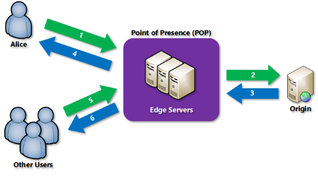

## General characteristics of Azure Cache for Redis

- it provides both the Redis open-source project and Redis Enterprise as a managed service
- application architecture scenarios:
  - caching data from the database (the cache-aside pattern)
  - caching content such as headers and banners
  - storing session data in the cache
  - using Redis as a message queue
  - executing a batch of Redis commands in a single transaction
- tiers:
  - **Basic**: OSS Redis cache running on a single VM, no SLA, it is limited to 53 GB of memory, and 20,000 connections
  - **Standard**: OSS Redis cache running on 2 VMs in a replicated configuration, has the same memory/connection limits as the Basic tier
  - **Premium**: high-performance OSS Redis caches deployed on more powerful VMs, up to 530 GB of memory, and 40,000 simultaneous connections
  - **Enterprise**: Redis Enterprise software which supports Redis modules like RediSearch, RedisBloom, and RedisTimeSeries
  - **Enterprise Flash**: more cost-effective, extends Redis Enterprise data storage to non-volatile memory

Note: The Basic tier is recommended for development and testing only.

Note: See more detailed pricing options [here](https://azure.microsoft.com/en-us/pricing/details/cache/).

## Configuring Azure Cache for Redis

- the Redis cache needs a globally unique name because Azure generates a public-facing URL to connect and communicate with the service
- the Premium tier allows you to persist data in two ways to provide disaster recovery:
  - RDB persistence takes a periodic snapshot and can rebuild the cache using the snapshot in case of failure
  - AOF persistence saves every write operation to a log that is saved at least once per second
- the Premium tier allows you to deploy the Redis cache in a virtual network
- the Premium tier offers clustering support
- every key has a TTL (time to live); when the TTL elapses, the key is automatically deleted
  - the expiry time resolution is always 1 millisecond
- there are always two access keys provided by Azure

## Azure Cache for Redis Code samples

- connecting to your Redis cache

```csharp
using StackExchange.Redis;
...
var connectionString = "[cache-name].redis.cache.windows.net:6380,password=[password-here],ssl=True,abortConnect=False";
var redisConnection = ConnectionMultiplexer.Connect(connectionString);
```

- accessing a Redis database

```csharp
IDatabase db = redisConnection.GetDatabase();
bool wasSet = db.StringSet("favorite:flavor", "i-love-rocky-road");
string value = db.StringGet("favorite:flavor");
Console.WriteLine(value); // displays: ""i-love-rocky-road""
```

- setting a binary value

```csharp
byte[] key = ...;
byte[] value = ...;

db.StringSet(key, value);
```

- getting a binary value

```csharp
byte[] key = ...;
byte[] value = db.StringGet(key);
```

- executing commands

```csharp
var result = db.Execute("ping");
Console.WriteLine(result.ToString()); // displays: "PONG"

var result = await db.ExecuteAsync("client", "list");
Console.WriteLine($"Type = {result.Type}\r\nResult = {result}");
```

- storing more complex values

```csharp
// example class
public class GameStat
{
  public string Id { get; set; }
  public string Sport { get; set; }
  public DateTimeOffset DatePlayed { get; set; }
  public string Game { get; set; }
  public IReadOnlyList<string> Teams { get; set; }
  public IReadOnlyList<(string team, int score)> Results { get; set; }

  public GameStat(string sport, DateTimeOffset datePlayed, string game, string[] teams, IEnumerable<(string team, int score)> results)
  {
    Id = Guid.NewGuid().ToString();
    Sport = sport;
    DatePlayed = datePlayed;
    Game = game;
    Teams = teams.ToList();
    Results = results.ToList();
  }

  public override string ToString()
  {
    return $"{Sport} {Game} played on {DatePlayed.Date.ToShortDateString()} - " +
      $"{String.Join(',', Teams)}\r\n\t" +
      $"{String.Join('\t', Results.Select(r => $"{r.team } - {r.score}\r\n"))}";
  }
}

// turning an instance of the class into a string
var stat = new GameStat("Soccer", new DateTime(2019, 7, 16), "Local Game",
        new[] { "Team 1", "Team 2" },
        new[] { ("Team 1", 2), ("Team 2", 1) });

string serializedValue = Newtonsoft.Json.JsonConvert.SerializeObject(stat);
bool added = db.StringSet("event:1950-world-cup", serializedValue);

// retrieving it and deserializing
var result = db.StringGet("event:2019-local-game");
var stat = Newtonsoft.Json.JsonConvert.DeserializeObject<GameStat>(result.ToString());
Console.WriteLine(stat.Sport); // displays "Soccer"
```

- cleaning up the connection

```csharp
redisConnection.Dispose();
redisConnection = null;
```

- other common operations: `CreateBatch`, `CreateTransaction`, `KeyDelete`, `KeyExists`, `KeyExpire`, `KeyRename`, `KeyTimeToLive`, `KeyType`

## General characteristics of Azure Content Delivery Networks

- it can cache static content but it can also accelerate/optimize dynamic content
- the requests are routed to the closest POP server; if the server does not have the file in its cache, it requests the file from the origin server and caches it 
- to use Azure CDN you need to create at least one CDN profile, which is a collection of CDN endpoints
  - the pricing tier is applied at the profile level
- [CDN limits](https://learn.microsoft.com/en-us/azure/azure-resource-manager/management/azure-subscription-service-limits)

## Azure CDN products

- Azure CDN Standard from Microsoft
- Azure CDN Standard from Akamai
- Azure CDN Standard from Verizon
- Azure CDN Premium from Verizon

## Cache behavior

- caching rules in the Microsoft tier are set at the endpoint level and provide three configuration options:
  - **ignore query strings**: new requests for the same asset will ignore any query strings until the TTL expires
  - **bypass caching for query strings**: each query request is passed directly to the origin server with no caching
  - **cache every unique URL**: the response for each unique URL is cached
- other tiers provide caching rules that can be either global or custom (targeting specific paths and file extensions) and query string caching
- default TTL values are as follows:
  - Generalized web delivery optimizations: seven days
  - Large file optimizations: one day
  - Media streaming optimizations: one year
- geo-filtering enables you to allow or block content in specific countries/regions
  - in the Microsoft tier, you can only allow or block the entire site; with the Verizon and Akamai tiers you can set up restrictions on directory paths
- you can purge content from the CDN when publishing a new version of the app or when you want to replace out-of-date assets

```bash
az cdn endpoint purge \
  --content-paths '/css/*' '/js/app.js' \
  --name ContosoEndpoint \
  --profile-name DemoProfile \
  --resource-group ExampleGroup

az cdn endpoint load \
  --content-paths '/img/*' '/js/module.js' \
  --name ContosoEndpoint \
  --profile-name DemoProfile \
  --resource-group ExampleGroup
```

## Azure CDN Code samples

- creating a CDN client

```csharp
static void Main(string[] args)
{
  // Create CDN client
  CdnManagementClient cdn = new CdnManagementClient(new TokenCredentials(authResult.AccessToken))
    { SubscriptionId = subscriptionId };
}
```

- listing CDN profiles and endpoints

```csharp
private static void ListProfilesAndEndpoints(CdnManagementClient cdn)
{
  // List all the CDN profiles in this resource group
  var profileList = cdn.Profiles.ListByResourceGroup(resourceGroupName);
  foreach (Profile p in profileList)
  {
    Console.WriteLine("CDN profile {0}", p.Name);
    if (p.Name.Equals(profileName, StringComparison.OrdinalIgnoreCase))
    {
      // Hey, that's the name of the CDN profile we want to create!
      profileAlreadyExists = true;
    }

    //List all the CDN endpoints on this CDN profile
    Console.WriteLine("Endpoints:");
    var endpointList = cdn.Endpoints.ListByProfile(p.Name, resourceGroupName);
    foreach (Endpoint e in endpointList)
    {
      Console.WriteLine("-{0} ({1})", e.Name, e.HostName);
      if (e.Name.Equals(endpointName, StringComparison.OrdinalIgnoreCase))
      {
        // The unique endpoint name already exists.
        endpointAlreadyExists = true;
      }
    }
    Console.WriteLine();
  }
}
```

- creating CDN profiles and endpoints

```csharp
private static void CreateCdnProfile(CdnManagementClient cdn)
{
  if (profileAlreadyExists)
  {
     // Check to see if the profile already exists
  }
  else
  {
    // Create the new profile
    ProfileCreateParameters profileParms =
    new ProfileCreateParameters() { Location = resourceLocation, Sku = new Sku(SkuName.StandardVerizon) };
    cdn.Profiles.Create(profileName, profileParms, resourceGroupName);
  }
}

private static void CreateCdnEndpoint(CdnManagementClient cdn)
{
  if (endpointAlreadyExists)
  {
    // Check to see if the endpoint already exists
  }
  else
  {
    // Create the new endpoint
    EndpointCreateParameters endpointParms =
      new EndpointCreateParameters()
      {
        Origins = new List<DeepCreatedOrigin>() { new DeepCreatedOrigin("Contoso", "www.contoso.com") },
        IsHttpAllowed = true,
        IsHttpsAllowed = true,
        Location = resourceLocation
      };
    cdn.Endpoints.Create(endpointName, endpointParms, profileName, resourceGroupName);
  }
}
```

- purging an endpoint

```csharp
private static void PromptPurgeCdnEndpoint(CdnManagementClient cdn)
{
  if (PromptUser(String.Format("Purge CDN endpoint {0}?", endpointName)))
  {
    Console.WriteLine("Purging endpoint. Please wait...");
    cdn.Endpoints.PurgeContent(resourceGroupName, profileName, endpointName, new List<string>() { "/*" });
    Console.WriteLine("Done.");
    Console.WriteLine();
  }
}
```

---
