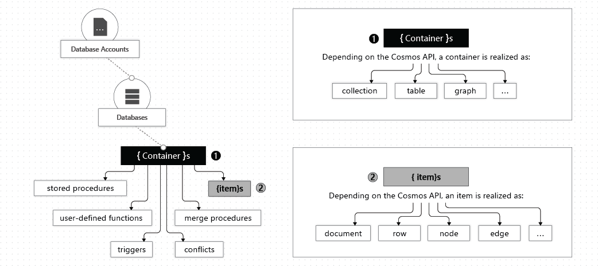
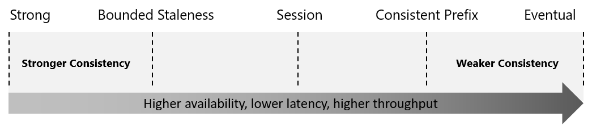

## General characteristics of Azure Cosmos DB

- fully managed, globally distributed NoSQL database that provides low latency, elastic scalability of throughput, well-defined semantics for data consistency, and high availability
- can be interacted with by using the Azure portal, the Azure CLI, or a language-specific SDK

## Global distribution benefits

- your app doesn't need to be redeployed to add or remove a region
- unlimited elastic write and read scalability
- 99.999% read and write availability for multi-region databases
- reads and writes served in less than 10 milliseconds 99% of the time

## Azure Cosmos DB Account

- there is a maximum of 50 Azure Cosmos DB accounts under an Azure subscription, but this limit can be raised via a support request
- the hierarchy of entities in an Azure Cosmos DB account: 

## Azure Cosmos DB databases

- there can be multiple databases in one account
- a database is analogous to a namespace
- a database is the unit of management for a set of containers

## Azure Cosmos DB containers

- a container is the unit of scalability for both provisioned throughput and storage
- a container is horizontally partitioned and then replicated across multiple regions
- there are two options for configuring throughput when you create a container:
  - dedicated provisioned throughput mode: the throughput provisioned is exclusively reserved for that specific container and it backed by SLAs
  - shared provisioned throughput mode: the throughput provisioned is shared with the other containers in the same database
- you can have both containers that share the same provisioned throughput and containers with dedicated provisioned throughput in the same database
- containers are schema-agnostic

## Azure Cosmos DB items

- an item can be a document in a collection, a row in a table, or a node or edge in a graph

## Consistency levels

- they work on a spectrum of choices 
- Azure Cosmos DB guarantees that 100% of read requests meet the consistency guarantee
- the default consistency level applies to all databases and containers under one Azure Cosmos DB Account
- Strong consistency:
  - the write operations are considered complete when the data is replicated in all regions, meaning that users always read the latest version of the data
- Bounded staleness consistency:
  - the "staleness" can be "bounded" in two ways:
    - by the number of versions (K) of an item
    - by the time interval (T) reads lag behind writes
  - for a single region account, the minimum value of K is 10 write operations, and the minimum value of T is 5 seconds
  - for a multi-region account, the minimum value of K is 100,000 write operations, and the minimum value of T is 300 seconds
  - "whichever is reached first"
- Session consistency:
  - within a single client session, reads are guaranteed to be consistent with the written data
- Consistent prefix consistency
  - single document writes see eventual consistency
  - updates made as batch within a transaction are returned consistent to the transaction in which they were committed (always Doc1 v1 and Doc2 v1, or Doc1 v2 and Doc2 v2, but NOT Doc1 v1 and Doc2 v2, or Doc1 v2 and Doc2 v1)
- Eventual consistency
  - there's no ordering guarantee for reads
  - the replicas eventually converge

## Supported APIs

- APIs allow your applications to treat Azure Cosmos DB as if it were various other databases technologies
- API for NoSQL:
  - data is stored in a document format
  - the API and SDK client libraries are made by Microsoft
  - it is the first to receive new features
- API for MongoDB:
  - data is stored in a document structure, via BSON
- API for PostgreSQL
  - uses the Citus open-source project to adapt PostgreSQL to a distributed/multi-node configuration
- API for Apache Cassandra
  - data is stored in column families
- API for Apache Gremlin
  - data is stored in graph format
- API for Table
  - improves on Azure Table storage
  - only supports OLTP (Online Transaction Processing) scenarios

## Request units

- the cost of all database operations is normalized by Azure Cosmos DB and is expressed by request units (or RUs)
- 1RU = the cost to fetch a single 1KB sized item by its ID and partition key value
- there are three modes in which you can create an account:
  - Provisioned throughput mode: you specify the number of RUs for your app on a per-second basis in increments of 100RUs/second; this number can be changed manually or programmatically
  - Serverless mode: you don't provision any throughput, you pay for the amount of RUs that has been consumed by your database operations
  - Autoscale mode: the provisioned throughput is automatically changed based on usage

## Partitions

- items in a container are divided into logical partitions based on the value of a partition key
- each item in a container has an item ID which is unique within a logical partition, combining the partition key and the item ID creates the item's index
- transactions work only in the same logical partition
- one or more logical partitions are mapped to a single physical partition
  - smaller apps with many logical partitions may require only one physical partition
- one physical partition has a maximum throughput of 10,000RUs/second and can store up to 50GB of data
- physical partitions are entirely managed by Azure Cosmos DB
  - throughput provisioned for a container is automatically divided evenly among physical partitions by relying on their connection with logical partitions
- partition key design is important to avoid a subset of partitions becoming "hot"
- a partition key has a partition key path and a partition key value (for example: "/itemId" and "1")
- a partition key should:
  - be a property that has a constant value
  - have a wide range of possible values
  - spread RU consumption and data storage evenly
- queries can be efficiently routed to only the relevant physical partitions by including the partition key in the filter predicate
  - if your partition key is something like "/itemId", then the cost for querying all items would be larger (due to an increase in RUs)
- a synthetic partition key can be created by:
  - concatenating multiple properties
  - using a random suffix on an existing property
  - using suffixes that can be calculated based on an existing property

## Azure Cosmos DB.NET V3 SDK examples for the SQL API

### CosmosClient

```csharp
CosmosClient client = new CosmosClient(endpoint, key);
```

### Database examples

- Create a database

```csharp
DatabaseResponse databaseResponse = await client.CreateDatabaseIfNotExistsAsync(databaseId, 10000);
```

- Read a database by ID

```csharp
DatabaseResponse readResponse = await database.ReadAsync();
```

- Delete a database

```csharp
await database.DeleteAsync();
```

### Container examples

- Create a container

```csharp
ContainerResponse simpleContainer = await database.CreateContainerIfNotExistsAsync(
    id: containerId,
    partitionKeyPath: partitionKey,
    throughput: 400);
```

- Get a container by ID

```csharp
Container container = database.GetContainer(containerId);
ContainerProperties containerProperties = await container.ReadContainerAsync();
```

- Delete a container

```csharp
await database.GetContainer(containerId).DeleteContainerAsync();
```

### Item examples

- Create an item

```csharp
ItemResponse<SalesOrder> response = await container.CreateItemAsync(salesOrder, new PartitionKey(salesOrder.AccountNumber));
```

- Read an item

```csharp
string id = "[id]";
string accountNumber = "[partition-key]";
ItemResponse<SalesOrder> response = await container.ReadItemAsync(id, new PartitionKey(accountNumber));
```

- Query an item

```csharp
QueryDefinition query = new QueryDefinition(
    "select * from sales s where s.AccountNumber = @AccountInput ")
    .WithParameter("@AccountInput", "Account1");

FeedIterator<SalesOrder> resultSet = container.GetItemQueryIterator<SalesOrder>(
    query,
    requestOptions: new QueryRequestOptions()
    {
        PartitionKey = new PartitionKey("Account1"),
        MaxItemCount = 1
    });
```

## Stored procedures, triggers, and user-defined functions

### Stored procedures

- example code:

```js
var createDocumentStoredProc = {
  id: 'createMyDocument',
  body: function createMyDocument(documentToCreate) {
    var context = getContext();
    var collection = context.getCollection();
    var accepted = collection.createDocument(
      collection.getSelfLink(),
      documentToCreate,
      function (err, documentCreated) {
        if (err) throw new Error('Error' + err.message);
        context.getResponse().setBody(documentCreated.id);
      }
    );
    if (!accepted) return;
  },
};
```

- can use Arrays as parameters, need to take into account that all arguments are passed as strings and need to be JSON parsed
- stored procedures have a limited amount of time to run on the server
- transactions using stored procedures can be paused and then resumed

### Triggers

- pre-triggers are used to validate the properties of an item that is being created
- pre-triggers cannot have any input parameters, they use the request object to manipulate the request message associated with the operation
  - the request message body contains the item to be created in JSON format
- when triggers are registered, you can specify the operations that it can run with (for example: `TriggerOperation.Create`)
- post-triggers run after an item is created
- post-triggers run as part of the same transaction, so an exception during the post-trigger execution will fail the whole transaction

### User-defined functions (UDFs)

- can be used inside a query
- example: code

```js
function tax(income) {
  if (income == undefined) throw 'no input';

  if (income < 1000) return income * 0.1;
  else if (income < 10000) return income * 0.2;
  else return income * 0.4;
}
```
