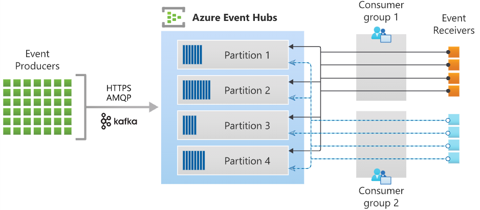

## Azure Event Grid

Note: For subscriptions that haven't previously used Event Grid, you need to register the Event Grid resource provider.

```bash
az provider register --namespace Microsoft.EventGrid
```

```bash
az provider show --namespace Microsoft.EventGrid --query "registrationState"
```

### Main concepts in Azure Event Grid

- **events**: an event is the smallest amount of information that fully describes something that happened in the system
  - size up to 64 KB is covered by GA SLA; support for size up to 1 MB is in preview
  - events are sent in arrays with total size up to 1 MB, but you are charged in 64 KB increments
- **event sources**: where the event took place
  - there is built-in support for events coming from Azure services
- **topics**: every endpoint where publishers send events
  - system topics vs custom topics
  - when publishing events to custom topics, consider providing the path for where the event happened, so subscribers can filter by segments of that path
- **event subscriptions**: the built-in mechanism to route events, sometimes to more than one handler
  - this is where filtering takes place
- **event handlers**: the apps or services reacting to the event
  - depending on the type of handlers, Event Grid has different mechanisms to guarantee the delivery of events (retry strategies)

### Event schemas

- events are written in json format
- the `subject`, `eventType`, `eventTime`, and `id` properties are required
- the `data` property contains data specific to the resource provider
- Azure Event Grid schema example:

```json
[
  {
    "topic": string,
    "subject": string,
    "id": string,
    "eventType": string,
    "eventTime": string,
    "data": {
      // object unique to each publisher
    },
    "dataVersion": string, // schema version of the data object
    "metadataVersion": string // schema version of the event metadata
  }
]
```

- Azure Event Grid natively supports events in the JSON implementation of CloudEvents v1.0 (open specification for describing event data)
- example of an event in the CloudEvents format:

```json
{
  "specversion": "1.0",
  "type": "Microsoft.Storage.BlobCreated",
  "source": "/subscriptions/{subscription-id}/resourceGroups/{resource-group}/providers/Microsoft.Storage/storageAccounts/{storage-account}",
  "id": "9aeb0fdf-c01e-0131-0922-9eb54906e209",
  "time": "2019-11-18T15:13:39.4589254Z",
  "subject": "blobServices/default/containers/{storage-container}/blobs/{new-file}",
  "dataschema": "#",
  "data": {
    "api": "PutBlockList",
    "clientRequestId": "4c5dd7fb-2c48-4a27-bb30-5361b5de920a",
    "requestId": "9aeb0fdf-c01e-0131-0922-9eb549000000",
    "eTag": "0x8D76C39E4407333",
    "contentType": "image/png",
    "contentLength": 30699,
    "blobType": "BlockBlob",
    "url": "https://gridtesting.blob.core.windows.net/testcontainer/{new-file}",
    "sequencer": "000000000000000000000000000099240000000000c41c18",
    "storageDiagnostics": {
      "batchId": "681fe319-3006-00a8-0022-9e7cde000000"
    }
  }
}
```

- the `content-type` header value for the CloudEvents schema is `"application/cloudevents+json; charset=utf-8"`; for Event Grid schema, that header value is `"application/json; charset=utf-8"`

### Event delivery

- Event Grid doesn't guarantee order for event delivery
- you can set up to 10 HTTP headers that are included in delivered events within a specific subscription

#### Retry schedule and retry policy

- Event Grid tries to deliver each event at least once per matching subscription immediately; if a subscriber's endpoint doesn't acknowledge receipt or if there is a failure, it retries delivery based on a fixed retry schedule and retry policy
- if the issue is a type of error that can't be fixed with retries, Event Grid will either perform dead-lettering (if configured) or drop the event; if not, the message is queued for retry using an exponential backoff policy
- the retry policy can be customized to drop the event after a maximum number of attempts (with a default of 30) or maximum time (1440 minutes by default)

#### Output batching

- you can turn on event batching for improved HTTP performance in high-throughput scenarios; there are two options: max events per batch, and preferred batch size in kilobytes (it is called "preferred" because the batch size can be smaller or larger in practice)

#### Delayed delivery

- as an endpoint experiences delivery failures, Event Grid will begin to delay the delivery and retry of events to that endpoint
- this functionality is meant to protect unhealthy endpoints

#### Dead-lettering

- when Event Grid can't deliver an event within the limits of the retry policy (number of attempts or event time-to-live), it can send the undelivered event to a storage account
- there is a five-minute delay between the last attempt to deliver an event and when it is delivered to the dead-letter location
- if the dead-letter location is unavailable for four hours, the event is dropped

### Azure Event Grid Access control

- done using Azure RBAC
- the built-in roles are: _Event Grid Subscription Reader_, _Event Grid Subscription Contributor_, _Event Grid Contributor_, and _Event Grid Data Sender_
- if you're using an event handler that isn't a WebHook, you need write access to that resource (the permission is called **Microsoft.EventGrid/EventSubscriptions/Write**)

### Endpoint validation

- when using webhooks external to Azure, Event Grid needs to verify ownership by sending an event that contains a `validationCode` property in its data portion; your application is expected to send the code back in the response body
- validation can be done via a synchronous handshake (at the time of event subscription creation) or an asynchronous handshake
- there is an option for performing a manual validation handshake using a property named `validationUrl` (the webhook must respond with an HTTP status code of 200, and you need to GET request that URL in a 5 minute time frame)
- self-signed certificates for validation aren't supported

### Event filtering

- you can filter by event type

```json
"filter": {
  "includedEventTypes": [
    "Microsoft.Resources.ResourceWriteFailure",
    "Microsoft.Resources.ResourceWriteSuccess"
  ]
}
```

- you can specify a starting or ending string value for the subject

```json
"filter": {
  "subjectBeginsWith": "/blobServices/default/containers/mycontainer/log",
  "subjectEndsWith": ".jpg"
}
```

- advanced filtering lets you filter by values in the data fields by specifying the operator type, key, and value(s)

```json
"filter": {
  "advancedFilters": [
    {
      "operatorType": "NumberGreaterThanOrEquals",
      "key": "Data.Key1",
      "value": 5
    },
    {
      "operatorType": "StringContains",
      "key": "Subject",
      "values": ["container1", "container2"]
    }
  ]
}
```

## Azure Event Hubs

### Key concepts

- Event Hubs uses a partitioned consumer model 
- an **Event Hubs client** is the primary interface for developers interacting with the Event Hubs client library
- an **Event Hubs producer** is a type of client that serves as a source of events
- an **Event Hubs consumer** is a type of client which reads information from the Event Hub and processes it
- a **partition** is an ordered sequence of events that is held in an Event Hub
  - the number of partitions is specified at the time an Event Hub is created and cannot be changed
- a **consumer group** is a logical grouping of consumers that subscribe to the same set of event data
  - each consumer group maintains its own offset
  - there can be at most 5 concurrent readers on a partition per consumer group, but it is recommended that there is only one because otherwise they will receive duplicates
- an **event receiver** can be any entity that reads data from an Event Hub
- **throughput units** or **processing units**
  - one throughput unit allows 1 MB per second or 1000 events per second of ingress and twice that amount of egress
  - Standard Event Hubs can be configured with 1 to 20 throughput units, the limit can be increased by sending a support request
  - usage beyond your purchased throughput units is throttled
- Event Hubs for Apache Kafka enables users to connect to Azure Event Hubs using the Kafka protocol

### Event Hubs Capture

- it enables you to automatically capture the streaming data in Event Hubs in an Azure Blob storage or Azure Data Lake Storage account 
- captured data is written in Apache Avro format
- you can configure a window (minimum size or minimum time, depending on which one is reached first) to trigger a capture operation
- Event Hubs Capture bypasses throughput unit egress quotas
- the storage naming convention is as follows: `{Namespace}/{EventHub}/{PartitionId}/{Year}/{Month}/{Day}/{Hour}/{Minute}/{Second}`

### Scaling the processing application

- you can automatically balance the load between multiple instances of your application by using `EventProcessorClient` (in .NET or Java) or `EventHubConsumerClient` (in Python and JavaScript)
  - in this context, balancing means increasing or decreasing the consumers dynamically
- each event processor is given a unique identifier and claims ownership of partitions by adding or updating an entry in a checkpoint store
  - this data is then used to balance the load among the active processors
- checkpointing means marking the position of the last successfully processed event within a partition which allows for new instances to continue the work of previous processors by reading the offset
  - it's possible to return to older data by specifying a lower offset
- calls to a function that processes the events queue up as the event pump continues to run in the background on the other threads; events from different partitions can be processed concurrently

### Azure Event Hubs Access control

- Azure Event Hubs supports both AAD RBAC and SAS to handle authentication and authorization
- the built-in roles for authorizing access to Event Hubs data using AAD are: _Azure Event Hubs Data Owner_, _Azure Event Hubs Data Sender_, _Azure Event Hubs Data Receiver_
- each client is assigned a unique token (SAS key) that lets them send events to only one event publisher (virtual endpoint)
  - typically each client is associated with a different event publisher, but not necessarily
- event consumers need to have the _manage_ rights or the _listen_ privileges assigned at the entity level
  - the privileges defined at the namespace level or the event hub instance or topic level will be applied to the consumer groups of that entity

### Code samples

- inspect an Event Hub

```csharp
var connectionString = "<< CONNECTION STRING FOR THE EVENT HUBS NAMESPACE >>";
var eventHubName = "<< NAME OF THE EVENT HUB >>";

await using (var producer = new EventHubProducerClient(connectionString, eventHubName))
{
  string[] partitionIds = await producer.GetPartitionIdsAsync();
}
```

- publish events to an Event Hub

```csharp
var connectionString = "<< CONNECTION STRING FOR THE EVENT HUBS NAMESPACE >>";
var eventHubName = "<< NAME OF THE EVENT HUB >>";

await using (var producer = new EventHubProducerClient(connectionString, eventHubName))
{
  using EventDataBatch eventBatch = await producer.CreateBatchAsync();
  eventBatch.TryAdd(new EventData(new BinaryData("First")));
  eventBatch.TryAdd(new EventData(new BinaryData("Second")));

  await producer.SendAsync(eventBatch);
}
```

- read events from an Event Hub

```csharp
var connectionString = "<< CONNECTION STRING FOR THE EVENT HUBS NAMESPACE >>";
var eventHubName = "<< NAME OF THE EVENT HUB >>";

string consumerGroup = EventHubConsumerClient.DefaultConsumerGroupName;

await using (var consumer = new EventHubConsumerClient(consumerGroup, connectionString, eventHubName))
{
  using var cancellationSource = new CancellationTokenSource();
  cancellationSource.CancelAfter(TimeSpan.FromSeconds(45));

  await foreach (PartitionEvent receivedEvent in consumer.ReadEventsAsync(cancellationSource.Token))
    {
      // At this point, the loop will wait for events to be available in the Event Hub. When an event is available, the loop will iterate with the event that was received. Because we did not specify a maximum wait time, the loop will wait forever unless cancellation is requested using the cancellation token.
    }
}
```

- read events from an Event Hub partition

```csharp
var connectionString = "<< CONNECTION STRING FOR THE EVENT HUBS NAMESPACE >>";
var eventHubName = "<< NAME OF THE EVENT HUB >>";

string consumerGroup = EventHubConsumerClient.DefaultConsumerGroupName;

await using (var consumer = new EventHubConsumerClient(consumerGroup, connectionString, eventHubName))
{
  EventPosition startingPosition = EventPosition.Earliest;
  string partitionId = (await consumer.GetPartitionIdsAsync()).First();

  using var cancellationSource = new CancellationTokenSource();
  cancellationSource.CancelAfter(TimeSpan.FromSeconds(45));

  await foreach (PartitionEvent receivedEvent in consumer.ReadEventsFromPartitionAsync(partitionId, startingPosition, cancellationSource.Token))
    {
      // At this point, the loop will wait for events to be available in the partition. When an event is available, the loop will iterate with the event that was received. Because we did not specify a maximum wait time, the loop will wait forever unless cancellation is requested using the cancellation token.
    }
}
```

- process events using an Event Processor client

```csharp
var cancellationSource = new CancellationTokenSource();
cancellationSource.CancelAfter(TimeSpan.FromSeconds(45));

var storageConnectionString = "<< CONNECTION STRING FOR THE STORAGE ACCOUNT >>";
var blobContainerName = "<< NAME OF THE BLOB CONTAINER >>";

var eventHubsConnectionString = "<< CONNECTION STRING FOR THE EVENT HUBS NAMESPACE >>";
var eventHubName = "<< NAME OF THE EVENT HUB >>";
var consumerGroup = "<< NAME OF THE EVENT HUB CONSUMER GROUP >>";

Task processEventHandler(ProcessEventArgs eventArgs) => Task.CompletedTask;
Task processErrorHandler(ProcessErrorEventArgs eventArgs) => Task.CompletedTask;

var storageClient = new BlobContainerClient(storageConnectionString, blobContainerName);
var processor = new EventProcessorClient(storageClient, consumerGroup, eventHubsConnectionString, eventHubName);

processor.ProcessEventAsync += processEventHandler;
processor.ProcessErrorAsync += processErrorHandler;

await processor.StartProcessingAsync();

try
{
  // The processor performs its work in the background; block until cancellation to allow processing to take place.
  await Task.Delay(Timeout.Infinite, cancellationSource.Token);
}
catch (TaskCanceledException)
{
  // This is expected when the delay is canceled.
}

try
{
  await processor.StopProcessingAsync();
}
finally
{
  // To prevent leaks, the handlers should be removed when processing is complete.
  processor.ProcessEventAsync -= processEventHandler;
  processor.ProcessErrorAsync -= processErrorHandler;
}
```

Note: For production scenarios, it is recommended that the `EventProcessorClient` be used for reading and processing events.
