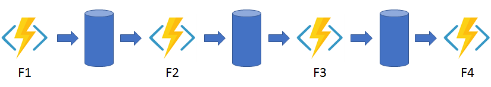
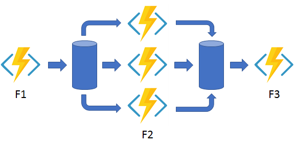
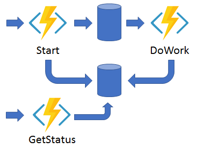
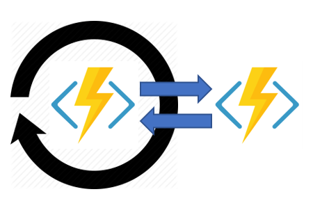
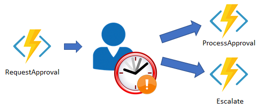

## General characteristics of Azure Functions

- serverless (if not Always On) functions service
- each function must have only one trigger (which can also act as an input binding) and multiple bindings to simplify coding for input and output data

Note: serverless = PaaS + on-demand + consumption based pricing + elasticity + scales to zero

## Function Apps

- are the deployment, management, and scaling unit
- a Function App groups multiple functions with the same pricing plan, runtime version, same language, etc. into a logical container

## Comparison with other Azure services

### Logic Apps

- Functions are code-first, Logic Apps are desginer-first
- Logic Apps support more connectors (for integrating with other services + I/O), you would have to write custom code for those when using Functions
- Functions integrate with Application Insights, Logic Apps can be monitored only from Azure Monitor logs within the portal
- Logic Apps can integrate with Azure Functions and Azure Functions can integrate with Logic Apps

### WebJobs

- the Azure Functions service is built on top of the WebJobs SDK
- both are built on Azure App Service
- Azure Functions offers more features (automatic scaling = elasticity, pay-per-use pricing, integration with Logic Apps, the option to develop and test in browser), more options for programming languages, development environments, and pricing (tiers) => it is usually the better choice

## Hosting Options

- chose per Function App
- the three main hosting plans are:
  - Consumption plan (default): typical serverless offering
  - Premium plan: same as consumption + pre-warmed workers for no cold starts, more compute power, the ability to connect to virtual networks
  - Dedicated plan: runs the functions within an App Service plan, best suited for long-running scenarios where you can't use Durable Functions
- other hosting options:
  - App Service Environment (ASE): fully isolated and dedicated environment for securely running App Service apps at high scale
  - Kubernetes: to integrate with Kubernetes

## Always On

- works with the Dedicated Plan (on an App Service plan) and makes the Function App not scale to zero

## Storage requirements

- a Function App requires a general Azure Storage account
- the storage account is used for storing the logs and managing triggers
- the function code files are stored on Azure Files shares on this storage account
- the same storage account can be used to store the application data, but this isn't recommended for storage-intensive operations

## Scaling Azure Functions

- each instance of the Functions host in the Consumption plan is limited to 1.5 GB of memory and one CPU
- the scale controller monitors the rate of events and determines whether to scale in or scale out
- the unit of scale for Azure Functions is the function app
- serverless means you need to deal with cold starts
- a single Function App with the Consumption plan can scale out to a maximum of 200 instances, but there isn't a limit on the number of concurrent executions
- the maximum instance limit of the Premium plan is 100
- for HTTP triggers, new instances are allocated at a maximum of one per second, while for non-HTTP triggers, new instances are allocated, at most, once every 30 seconds
- `functionAppScaleLimit` can be set to lower the maximum instances, `0` or `null` means default
- you can enable autoscaling when running in an App Service plan

## Triggers and bindings

- specified in `function.json` for each function when using a non-compiled language
- when using `function.json` you can add bindings graphically with the wizard under the Integration tab, and you can also edit the file directly in the portal
- specified by decorating methods with C# attributes or Java annotations in C# and Java
- each binding has a type (`httpTrigger` for example), direction (`in` or `out`), and name (used to access data in code) + additional parameters by case
- for dynamically typed languages, use the `dataType property` for each binding

## Connection strings in Azure Functions

- used to connect to other Azure services
- when deployed, they cannot be directly referred to in `function.json` and need to be used from environment variables
- when running the project locally, they are set in the local settings file
- double underscores are used to select an item from a collection
- some connections in Azure Functions are configured to use an identity instead of a secret (which must have been assigned the right role with only the required privileges - RBAC, the principle of least privilege)
- identity-based connections are not supported in Durable Functions

## Folder Structure

- `host.json` contains runtime-specific configurations and is in the root folder of the app
- there can be a `node_modules` or equivalent folder at the root
- `local.settings.json` contains app settings and settings used by local development tools when running the app locally

## Durable Functions app patterns

- the durable functions extension lets you define stateful workflows
- supported languages: C#, C# script, JavaScript, Python, F#, Powershell
- typical applications patterns:
  - function chaining: 
  - fan out/fan in: 
  - async HTTP API: 
  - monitor: 
  - human interaction: 
- function types:
  - orchestrator functions: describe how actions are executed in a deterministic, procedural manner
    - execution progress is automatically checkpointed when the orchestrator uses `await` or `yield`
  - activity functions: the basic unit of work, they do the processing
    - they are triggered by an activity trigger that generates a `DurableActivityContext` in .NET or `context` object in JavaScript
    - can only have a single value passed to them, use arrays/tuples/other complex types as a workaround
  - entity functions: define operations for reading and updating state
    - they are triggered by an entity trigger
    - they are accessed via a unique entity ID
    - operations on entities require that you specify the Entity ID and the Operation name
  - client functions: trigger the orchestrator
- orchestrator and entity functions cannot be triggered directly using the buttons in the Azure portal
- a task hub is a logical container for the durable storage resources used for orchestrations and entities, it is created automatically such that the Durable Function App can run
- orchestrations and entities can only interact with each other if they belong to the same task hub
- each Function App must be configured with a separate task hub, even if they share the same storage account
- a task hub consists of the following resources:
  - one or more control queues
  - one work-item queue
  - one history table
  - one instances table
  - one storage container containing one or more lease blobs
  - a storage container containing large message payloads, if applicable
- task hubs must have unique names within their Azure Storage account
- each instance of orchestration has an instance identifier (autogenerated GUID)
  - user-generated instance IDs are intended for scenarios where there is a one-to-one mapping between an orchestration and some external application-specific entity
  - it is recommended to save instance IDs to some external location for data tracking in Application Insights, troubleshooting, or analytics purposes
- the execution state of orchestrator functions is maintained because whenever the `await` or `yield` operators are used, the control of the orchestrator thread is given back to the Durable Task Framework dispatcher that relies on the task hub (which contains the execution history)
- features and patterns of orchestrators:
  - sub-orchestrations: orchestrators calling other orchestrators
  - durable timers: to implement delays or timeouts
    - different from `Thread.Sleep` and `Task.Delay` (C#) or `setTimeout()` and `setInterval()` (JavaScript)
  - external events: orchestrators can wait for external events, they can also send external events using an orchestration instance ID
  - error handling: `try/catch`
  - critical sections: security measure to avoid race conditions
  - calling HTTP endpoints: orchestrators aren't permitted to do I/O, but can activity functions (think of the wrapper scenario)
  - passing multiple parameters: with arrays/tuples/other complex data types
- durable timers must be canceled if the code will not wait for them to complete (when escalating)
  - cancelation doesn't terminate the process, it allows the orchestrator to ignore the result
