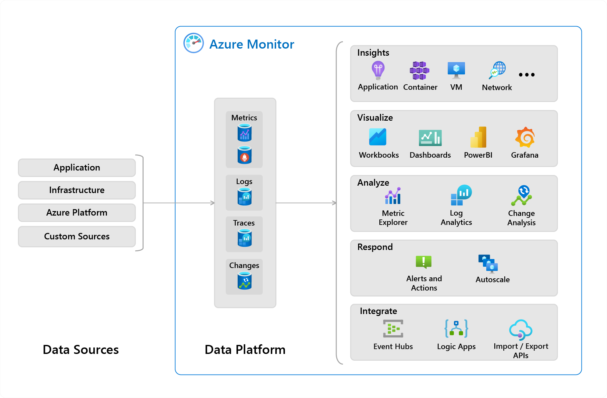
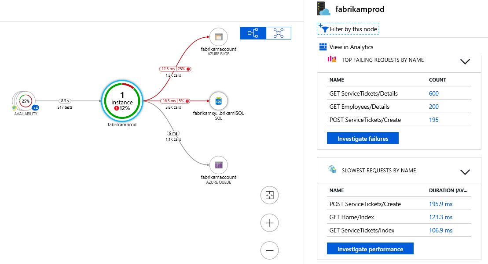

## General characteristics of Azure Monitor

- it is the central service that allows collecting, analyzing, and responding to metrics, logs, traces, and changes in Azure 
- "pillars of observability":
  - metrics: numerical values that describe some aspects of a system at a particular point in time
  - logs: text or structured data which describe an event that occurred within the system
  - distributed traces: series of related events that follow a user request through a distributed system
  - changes: series of events
- large scalable curated visualizations of monitoring data that require minimal configuration are known as "Insights"
  - Application Insights: monitoring for web applications, even if they are hosted on-premises
  - Container Insights: monitoring for container workloads deployed to AKS or ACI
  - VM Insights: monitoring for Windows and Linux virtual machines

## General characteristics of Application Insights

- offers metrics in real time
- probes your application's external endpoints to test the overall availability and responsiveness over time
- integrates with GitHub and Azure DevOps
- provides automatic failure and anomaly detection
- offers distributed tracing
- tracks request rates, response times, failure rates, exceptions, page view and load performance, AJAX calls, user and session counts, performance counters, custom events and metrics
- regularly tests the external services your application is using

## Application Insights metric types

- log-based metrics are translated into Kusto queries from stored events, making them better for data analysis
  - can be emitted by using the SDK or automatically collected from auto-instrumentation
  - when the volume of events is too high, Application Insights implements several telemetry volume reduction techniques which lower the accuracy of the metrics that must perform query-time aggregations
- standard metrics are stored as pre-aggregated time series, making them much faster to retrieve
  - the newer SDKs pre-aggregate metrics during collection (this is also true for the standard metrics sent by default), so the accuracy isn't affected by sampling or filtering
  - for older SDKs, the Application Insights backend aggregates the events received by the collection endpoint before ingestion sampling (this means that the only difference is that there's more data transmitted over the network)

## Instrumentation options for app monitoring

- auto-instrumentation requires no developer investment
- the Application Insights SDKs
- OpenCensus (open source, vendor-agnostic, single distribution of libraries that provide metrics collection and distributed tracing for services)

## Availability testing

- you can set up a test for the availability of any accessible HTTP(S) endpoint, and it executes at regular time intervals from points around the world
- options:
  - simple URL ping test: it relies on the DNS infrastructure of the public internet
  - Standard test: verifies the SSL certificate validity, and it allows you to specify the HTTP request verb, custom headers, and custom data
  - Custom TrackAvailability test: this would be a custom program you write, use this if you need multiple steps

## Application Map

- offers a visual map of the topology of a distributed application and shows metrics about each component or dependency, with the option to see more in Application Insights or Azure diagnostics
- components can be separate Application Insights instrumentation keys or different roles reporting to a single Application Insights instrumentation key
- the Application Map finds components by following HTTP dependency calls made between servers with the Application Insights SDK installed
- the name of the components is based on the cloud role name property and can be manually set or overwritten

---
